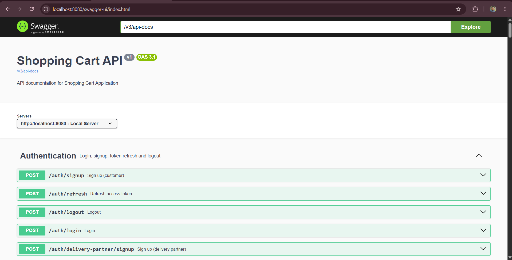
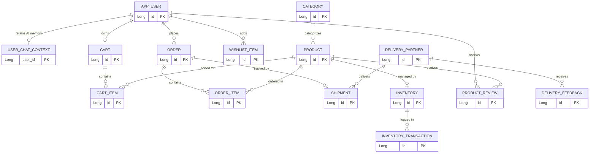

#  Nexis Store Backend API

An enterprise-grade, feature-rich E-Commerce RESTful API built with **Java 21** and **Spring Boot 3.5**. This backend powers a complete modern shopping experience, including an autonomous **Agentic AI Shopping Assistant** (Spring AI + Gemini), product scraping, inventory management, secure payments, and delivery tracking.

🌐 **Live Application:** The frontend application consuming this deployed Render backend is live at: [https://nexis-store-sigma.vercel.app/](https://nexis-store-sigma.vercel.app/)

## 🌟 Key Highlights for Recruiters & Project Managers
- **Agentic AI Shopping Assistant**: Integrated AI agent powered by **Spring AI 1.1** and **Google Gemini (Gemini 3.6 Flash / 3.5 Flash)** with autonomous **Tool Calling** (Cart, Orders, Products, Wishlist, Addresses, Payments) and database-backed persistent **JPA Chat Memory**.
- **Modern Tech Stack**: Leverages the latest Java 21 features and Spring Boot 3.5 for high performance and maintainability.
- **Advanced Concurrency Handling**: Implements Optimistic Locking with Spring Retry & AOP to prevent race conditions during inventory checkout.
- **Integrated Web Scraping**: Utilizes Microsoft Playwright to scrape real-time product data (Amazon/Flipkart).
- **Enterprise Security**: Secure stateless authentication using robust JWTs alongside OAuth2 Client for Google/Facebook social logins.
- **Reliable Email System**: Replaces basic SMTP with the resilient Gmail REST API (Google API Client) for transactional emails.
- **Cloud & Production Ready**: Deployed on **Render** with a **TiDB Cloud Serverless** database. Includes Flyway for database versioning, Spring Boot Actuator for health monitoring, and Razorpay for seamless payment processing.
- **Comprehensive Logistics**: Dedicated modules for managing Delivery Partners, Shipments, and tracking Delivery Feedback.

## 🚀 Features

### 🤖 Agentic AI Assistant
- **Autonomous Tool Execution**: Powered by Gemini 3.6 Flash / 3.5 Flash, the AI reasons over user intent and autonomously invokes backend Java tools to search products, view/update cart, toggle wishlist items, fetch addresses, and initiate checkout.
- **Persistent Chat Memory**: Database-backed conversational memory (`user_chat_context`) with sliding window limits and lazy session expiration.
- **Protected Multi-Step Checkout**: Conversational checkout flow with explicit confirmation for destructive actions and Razorpay payment link generation.
- **Command Support**: Includes `/clear` command for instantaneous chat state reset.

### 🛍️ Core E-Commerce
- **Product & Category Management**: Dynamic attributes, product images, and hierarchical categories.
- **Cart & Wishlist**: Real-time shopping cart management and user wishlists.
- **Order Management**: Comprehensive order lifecycle tracking (status updates, order items).
- **Inventory Management**: Transactional inventory tracking (restock, reserve, release) with optimistic locking.
- **Reviews & Ratings**: Product reviews and detailed delivery feedback mechanism.

### 🚚 Delivery & Logistics
- **Delivery Partner Portal**: Manage delivery agents, their status, and assigned shipments.
- **Shipment Tracking**: Track orders from dispatch to delivery.
- **Feedback System**: Granular delivery partner feedback and status monitoring.

### 💳 Payments & Checkout
- **Razorpay Integration**: Secure and seamless payment gateway integration (currently using **Razorpay Test API**).

### 🔐 Security & Users
- **Multi-Role Authentication**: Admin, User, and Delivery Partner roles.
- **OAuth2 Social Login**: Fully integrated **Google** and **Facebook** authentication for frictionless user onboarding.
- **JWT Authentication**: Token-based security with robust refresh token management.

### 🕸️ Scraper Module
- **Playwright Headless Browser**: Built-in scraper for Amazon and Flipkart to analyze competitor pricing or import products.

## 🛠️ Technology Stack
- **Core Framework**: Spring Boot 3.5.x, Java 21
- **AI & LLM Integration**: Spring AI 1.1.8, Google Gemini (via Google GenAI)
- **Database ORM**: TiDB Cloud Serverless (MySQL Compatible), Spring Data JPA, Hibernate
- **Database Migrations**: Flyway
- **Security**: Spring Security, JWT (JJWT), OAuth2
- **Payments**: Razorpay Java SDK
- **API Documentation**: Springdoc OpenAPI (Swagger UI)
- **Web Scraping**: Microsoft Playwright
- **Emailing**: Google API Client (Gmail REST API)
- **Tools**: Lombok, Spring Retry, Actuator, Jackson

## 📦 Getting Started

### Prerequisites
- Java 21
- Maven 3.8+
- MySQL / TiDB Database

### Setup Instructions
1. **Clone the repository**:
   ```bash
   git clone <repo-url>
   cd Shopping-Cart-BE
   ```
2. **Configure Environment Variables**:
   Ensure you configure your `application.properties` or environment variables for:
   - MySQL / TiDB Credentials (`DB_URL`, `DB_USERNAME`, `DB_PASSWORD`)
   - JWT Secret (`JWT_SECRET`)
   - Razorpay API Keys (`RAZORPAY_KEY_ID`, `RAZORPAY_KEY_SECRET`)
   - Google OAuth / Gmail API Credentials
   - Gemini AI API Key (`GEMINI_API_KEY`) and optional Model (`GEMINI_MODEL`, default: `gemini-3.5-flash` / `gemini-3.6-flash`)
   - Chatbot settings (`CHAT_MEMORY_MAX_MESSAGES`, `CHAT_SESSION_TIMEOUT_MINUTES`, `FRONTEND_URL`)

3. **Run the Application**:
   ```bash
   ./mvnw spring-boot:run
   ```
4. **Access API Documentation**:
   Once the server is running, explore the API endpoints using Swagger UI:
   `http://localhost:8080/swagger-ui.html`

## 📚 Technical Documentation & Deep-Dive Learning Guides

The `docs/` folder contains comprehensive, enterprise-grade architecture and implementation guides for this project:

- 📖 [**Agentic Chatbot Implementation Guide**](docs/agentic-chatbot-implementation-guide.md) — Comprehensive masterclass covering Spring AI, Gemini, Tool Calling, and JPA Chat Memory.
- 🛡️ [**Application Security Guide**](docs/Application-Security-Guide.md) — Deep dive into JWTs, OAuth2, and RBAC security architecture.
- 📦 [**Inventory Management Learning Guide**](docs/inventory-management-learning-guide.md) — Optimistic locking, concurrency, and Spring Retry.
- ✉️ [**Notification System Architecture**](docs/notification-system.md) — Event-driven transactional email system with Gmail REST API.
- 🚚 [**Shipment & Delivery Logistics**](docs/shipment_delivery_learning.md) — Delivery partner assignment and lifecycle management.
- ⚡ [**Performance Improvements**](docs/performance-improvements.md) — Production database indexing and query optimization notes.
- 🔗 [**Frontend Integration Guide**](FRONTEND_INTEGRATION_README.md) — Complete REST API contract and frontend integration notes.

## 🏗️ Architecture & Documentation

### 1. Interactive API Documentation (Swagger UI)


### 2. Database Schema (Entity-Relationship Diagram)



> *(Note: Only primary keys are shown to keep the diagram clean and easy to read at a glance).*
