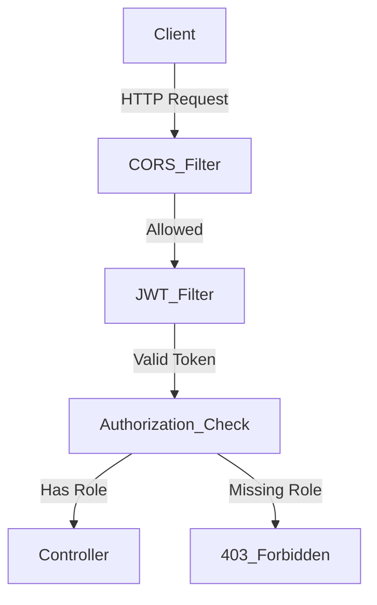
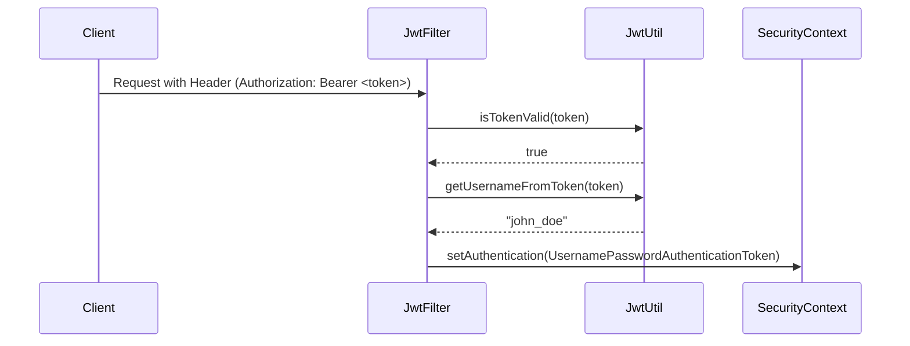
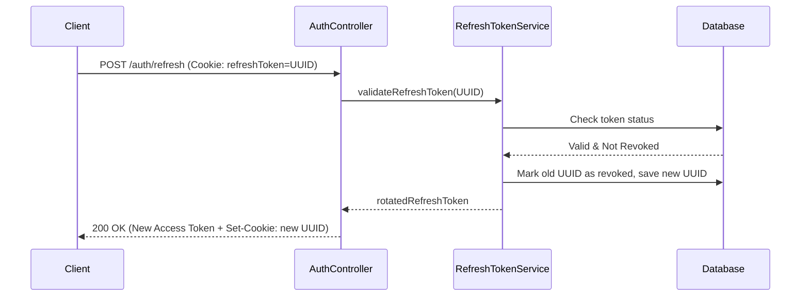
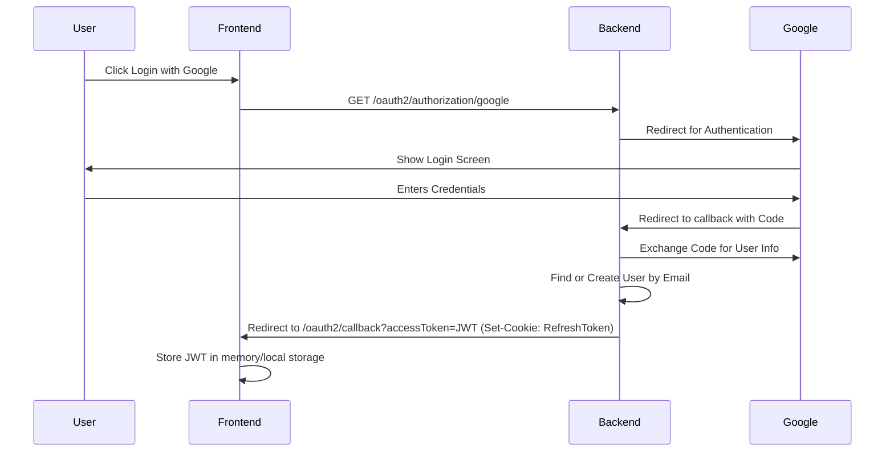
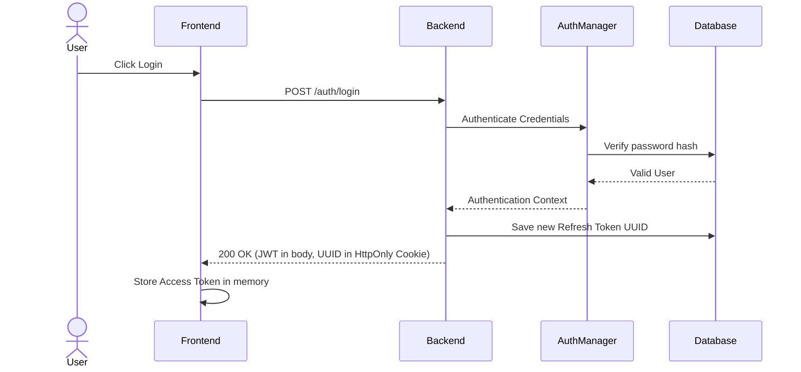

# Application Security Guide

Welcome to the comprehensive Application Security Guide for the Shopping Cart Backend. This document is designed for beginner Java/Spring Boot developers and explains every security-related implementation present in this project from scratch. 

---

## 1. Core Spring Security Architecture

### 1. Introduction
Spring Security is a framework that provides authentication (who are you?), authorization (what are you allowed to do?), and protection against common attacks. Without it, we would have to write custom code to intercept every HTTP request and check if the user is allowed to access the endpoint. 

### 2. How It Works In Theory
In theory, Spring Security works like a series of checkpoints (called a **Filter Chain**). When an HTTP request enters the application, it must pass through several filters before it reaches the Controller. Each filter checks something specific (e.g., is there a token? is CORS allowed?). If a request fails a check, it is rejected immediately. 

### 3. How It Is Implemented In This Project
In our project, we configure this Filter Chain inside the `SecurityConfig` class. We also separate the `PasswordEncoder` into its own `PasswordEncoderConfig` to avoid circular dependencies.
- We disable CSRF because our API is stateless and uses JWTs/Cookies.
- We configure CORS to allow our specific frontends (`http://localhost:4200` and Vercel).
- We define public endpoints (like `/auth/**` or `/api/products/**`) and protected endpoints (`/api/admin/**`).
- We set the session creation policy to `STATELESS`.

### 4. Code Walkthrough
**Location:** [src/main/java/com/demoproject/shoppingcart/config/SecurityConfig.java](file:///c:/Users/debma/My-Space/Codes/Shopping-cart-2025/Shopping-Cart-BE/src/main/java/com/demoproject/shoppingcart/config/SecurityConfig.java)

```java
@Bean
public SecurityFilterChain filterChain(HttpSecurity http) throws Exception {
    http
        .cors(cors -> cors.configurationSource(corsConfigurationSource()))
        .csrf(csrf -> csrf.disable()) // We don't need CSRF for stateless APIs
        .sessionManagement(session -> 
                session.sessionCreationPolicy(SessionCreationPolicy.STATELESS)
        )
        .authorizeHttpRequests(auth -> auth
                .requestMatchers("/auth/**", "/oauth2/**", "/login/oauth2/**", "/api/products/**").permitAll()
                .requestMatchers("/api/admin/**").hasRole("ADMIN")
                .anyRequest().authenticated()
        );
        
    // JWT filter is added before the default username/password filter
    http.addFilterBefore(jwtAuthenticationFilter, UsernamePasswordAuthenticationFilter.class);
    
    return http.build();
}
```
* **cors()**: Attaches our custom CORS policy. Without it, browsers would block the frontend from calling our backend.
* **csrf.disable()**: Disables Cross-Site Request Forgery protection. We disable it because we don't use server-side sessions.
* **sessionCreationPolicy(STATELESS)**: Tells Spring not to create HTTP Sessions. Every request must be authenticated independently using a token.
* **authorizeHttpRequests**: Defines which URLs are public, which require admin rights, and which just require the user to be logged in.

### 5. Execution Flow
Request Arrives 
↓ 
CORS Filter (Checks allowed origins) 
↓ 
SecurityFilterChain (Checks public vs protected URLs) 
↓ 
JwtAuthenticationFilter (Extracts and validates token) 
↓ 
Controller (Handles business logic)

### 6. Mermaid Diagrams


### 7. Behind The Scenes
Spring Boot automatically registers our `SecurityFilterChain` bean and injects it into the `DelegatingFilterProxy`, which is the bridge between the standard Java Servlet container (like Tomcat) and Spring Security. The `AuthenticationManager` is used under the hood to process login requests and verify credentials against our `UserDetailsService`.

### 8. Security Considerations
- **Why disable CSRF?** CSRF attacks rely on the browser automatically sending session cookies. Since we use `STATELESS` sessions and our authentication relies on the `Authorization: Bearer` header (for the access token), traditional CSRF is not a threat to our data-modifying endpoints.
- **CORS Whitelisting:** We strictly allow specific origins. This prevents malicious websites from reading responses from our API.
- **AllowCredentials(true):** Required because we use HttpOnly cookies for our refresh token.

### 9. Frequently Asked Questions
- **Why not store passwords in plain text?** If the database is compromised, attackers would instantly have all user passwords.
- **Why BCrypt?** BCrypt is a one-way hashing algorithm. It is slow by design, making brute-force attacks extremely difficult.

---

## 2. JWT Authentication

### 1. Introduction
JWT (JSON Web Token) is a standard for securely transmitting information between a client (frontend) and a server (backend) as a JSON object. We use it to verify the identity of the user on every request without hitting the database.

### 2. How It Works In Theory
When a user logs in, the server generates a JWT containing the user's username and role, signs it with a secret key, and sends it back. For all subsequent requests, the frontend sends this JWT in the `Authorization` header. The server verifies the signature using the same secret key. If valid, the server trusts the information inside the token.

### 3. How It Is Implemented In This Project
In this project, JWT logic is handled by `JwtUtil` (for generating and validating tokens) and `JwtAuthenticationFilter` (for intercepting requests). Our tokens have a short lifespan (`app.jwt.expiration-ms`). The token includes a "role" claim, so we know if the user is an ADMIN or USER without checking the database.

### 4. Code Walkthrough
**Location:** [src/main/java/com/demoproject/shoppingcart/security/JwtAuthenticationFilter.java](file:///c:/Users/debma/My-Space/Codes/Shopping-cart-2025/Shopping-Cart-BE/src/main/java/com/demoproject/shoppingcart/security/JwtAuthenticationFilter.java)

```java
String authHeader = request.getHeader("Authorization");
String token = null;
String username = null;

if (StringUtils.hasText(authHeader) && authHeader.startsWith("Bearer ")) {
    token = authHeader.substring(7); // remove "Bearer "
    if (jwtUtil.isTokenValid(token)) {
        username = jwtUtil.getUsernameFromToken(token);
    }
}
```
* **request.getHeader("Authorization")**: Grabs the token from the request.
* **startsWith("Bearer ")**: Standard format for passing JWTs.
* **isTokenValid(token)**: Validates the digital signature and expiration date.
* Without this filter, Spring wouldn't know how to extract the user's identity from the request.

### 5. Execution Flow
Request with Bearer Token 
↓ 
JwtAuthenticationFilter intercepts 
↓ 
Extracts Token 
↓ 
JwtUtil Validates Signature 
↓ 
Extracts Username 
↓ 
SecurityContextHolder is populated 
↓ 
Request proceeds to Controller

### 6. Mermaid Diagrams


### 7. Behind The Scenes
`OncePerRequestFilter` guarantees that our custom filter is executed exactly once per request. When we populate `SecurityContextHolder.getContext().setAuthentication(...)`, we are telling Spring Security, "This request is authenticated, treat them as this user."

### 8. Security Considerations
- **Stateless Validation:** Validating the JWT requires no database calls, making the API very fast.
- **Short Expiration:** If an Access Token is stolen, the attacker can only use it for a very short time before it expires.
- **Secret Key:** The `app.jwt.secret` must be kept entirely secret. If exposed, anyone can forge valid tokens.

### 9. Frequently Asked Questions
- **Why JWT?** It allows our backend to be stateless, scaling easily without managing active sessions in memory.
- **Why Access Token expires quickly?** To limit the window of opportunity if the token is compromised.
- **What happens if Access Token is stolen?** The attacker can act as the user, but only until the token expires (usually 15-30 mins).

---

## 3. Refresh Token Management

### 1. Introduction
Because Access Tokens expire quickly, we need a way to get a new one without forcing the user to log in again. This is what the Refresh Token does. It's a long-lived credential used solely to request new Access Tokens.

### 2. How It Works In Theory
Instead of sending a JWT for the refresh token, systems often generate a random string (like a UUID) and store it in the database. When the client's access token expires, it sends this UUID to a special `/refresh` endpoint. The server checks the database to see if the UUID is valid, not expired, and belongs to the user. If so, a new access token is generated.

### 3. How It Is Implemented In This Project
We use `RefreshTokenService` to manage UUID-based refresh tokens. They are stored in an `HttpOnly` cookie. This means JavaScript cannot read the token, making it immune to Cross-Site Scripting (XSS) attacks. We also implement **Refresh Token Rotation**: every time a refresh token is used, it is revoked, and a brand new one is issued.

### 4. Code Walkthrough
**Location:** [src/main/java/com/demoproject/shoppingcart/service/RefreshTokenService.java](file:///c:/Users/debma/My-Space/Codes/Shopping-cart-2025/Shopping-Cart-BE/src/main/java/com/demoproject/shoppingcart/service/RefreshTokenService.java)

```java
public RefreshToken validateRefreshToken(String rawToken) {
    RefreshToken token = refreshTokenRepository.findByToken(rawToken)
            .orElseThrow(() -> new TokenRefreshException(rawToken, "Token not found"));

    if (token.isRevoked()) {
        // === REUSE ATTACK DETECTED ===
        refreshTokenRepository.revokeAllActiveTokensForUser(token.getUser());
        throw new TokenRefreshException(rawToken, "Reuse attack detected");
    }

    if (token.getExpiryDate().isBefore(Instant.now())) {
        refreshTokenRepository.delete(token);
        throw new TokenRefreshException(rawToken, "Token has expired");
    }
    return token;
}
```
* **findByToken(rawToken)**: Checks if the token exists in the database.
* **isRevoked() check**: If a revoked token is used, it means someone (an attacker or the user across devices) is trying to reuse an old token. We immediately revoke ALL tokens for that user to secure the account.
* **Expiry check**: Ensures the token is still valid chronologically.

### 5. Execution Flow
Client notices Access Token expired 
↓ 
Client calls `/auth/refresh` (Cookie automatically sent) 
↓ 
AuthController reads Cookie 
↓ 
RefreshTokenService validates Token in DB 
↓ 
If valid, old token marked revoked, new token generated 
↓ 
New Access Token returned in body 
↓ 
New Refresh Token returned in Set-Cookie header

### 6. Mermaid Diagrams


### 7. Behind The Scenes
Spring's `@Transactional` annotation in `RefreshTokenService` ensures that the database operations (revoking the old token and saving the new one) happen atomically. If something fails, the entire transaction is rolled back.

### 8. Security Considerations
- **HttpOnly Cookie:** Protects the refresh token from XSS attacks.
- **Refresh Token Rotation:** Ensures a stolen refresh token can only be used once.
- **Reuse Detection:** If an attacker steals a refresh token and uses it, the legitimate user will eventually try to use their older token. The system detects this reuse and revokes everything, forcing a re-login.

### 9. Frequently Asked Questions
- **Why UUID Refresh Token?** UUIDs are opaque. They contain no user data, so if intercepted, they reveal nothing. They are also centrally managed in the DB, meaning we can revoke them instantly.
- **Why not JWT Refresh Token?** JWTs are hard to revoke before they naturally expire. UUIDs give us absolute control.
- **What happens if Refresh Token is stolen?** The attacker can get a new access token once. However, because of Rotation and Reuse Detection, the moment the legitimate user tries to refresh, all sessions are killed.

---

## 4. OAuth2 Login (Google & Facebook)

### 1. Introduction
OAuth2 allows users to log in using third-party services like Google or Facebook. Instead of creating a new password, the user authenticates with the provider, and the provider tells our application who the user is.

### 2. How It Works In Theory
The user clicks "Login with Google". They are redirected to Google's servers. After logging in, Google redirects them back to our server with an "authorization code". Our server exchanges this code for an Access Token from Google, uses it to fetch the user's email/profile, and then logs them into our system.

### 3. How It Is Implemented In This Project
We use Spring Security's `oauth2Login()`. Because our backend is stateless, we save the OAuth2 state in a cookie using `HttpCookieOAuth2AuthorizationRequestRepository` instead of an HTTP session.
For Google (OIDC), we use `CustomOidcUserService`. For Facebook, we use `CustomOAuth2UserService`. 
After successful login, `OAuth2AuthenticationSuccessHandler` generates our own internal JWT and Refresh Token, and redirects to the frontend with the JWT in the URL.

### 4. Code Walkthrough
**Location:** [src/main/java/com/demoproject/shoppingcart/oauth2/OAuth2AuthenticationSuccessHandler.java](file:///c:/Users/debma/My-Space/Codes/Shopping-cart-2025/Shopping-Cart-BE/src/main/java/com/demoproject/shoppingcart/oauth2/OAuth2AuthenticationSuccessHandler.java)

```java
AppUser appUser = userRepository.findByEmailId(email).orElseThrow(...);

// Issue our own system tokens
String accessToken  = jwtUtil.generateToken(appUser.getUserName(), appUser.getRole().name());
RefreshToken refreshToken = refreshTokenService.createRefreshToken(appUser.getId());

// Store refresh token in a secure HttpOnly cookie
String cookieValue = String.format("%s=%s; Max-Age=%d; Path=/; HttpOnly; SameSite=Strict", ...);
response.addHeader("Set-Cookie", cookieValue);

// Redirect to frontend with access token in query param
String targetUrl = UriComponentsBuilder.fromUriString(frontendRedirectUri)
        .queryParam("accessToken", accessToken)
        .build().toUriString();
getRedirectStrategy().sendRedirect(request, response, targetUrl);
```
* **findByEmailId(email)**: Finds or links the user based on the email provided by Google/Facebook.
* **jwtUtil.generateToken**: Generates our internal JWT so the rest of our system works normally.
* **sendRedirect**: Sends the user back to the Angular/React frontend. The frontend extracts the `accessToken` from the URL, stores it in memory, and clears the URL bar.

### 5. Execution Flow
User clicks "Login with Google" on Frontend 
↓ 
Backend redirects to Google 
↓ 
User logs in at Google 
↓ 
Google redirects to Backend `/login/oauth2/code/google` 
↓ 
Spring Security fetches User Profile 
↓ 
CustomOidcUserService links/creates `AppUser` 
↓ 
OAuth2AuthenticationSuccessHandler generates JWT & Refresh Token 
↓ 
Backend redirects to Frontend `http://localhost:4200/oauth2/callback?accessToken=<jwt>`

### 6. Mermaid Diagrams


### 7. Behind The Scenes
Spring handles the complex OAuth2 dance (state validation, code exchange) automatically. Our `CustomOAuth2UserService` implements an "Account Linking Policy". If a user signed up with `john@gmail.com` using a password, and later logs in with Google using `john@gmail.com`, we link the Google ID to the existing account rather than creating a duplicate.

### 8. Security Considerations
- **State Cookie:** We use a cookie to store the OAuth2 state parameter to prevent CSRF attacks during the OAuth flow, since we don't have server sessions.
- **JWT in URL:** Passing the access token in the URL query parameter is slightly risky because URLs can be logged in browser history. However, it's short-lived, and the frontend is expected to immediately clear the URL. The highly sensitive Refresh Token is kept securely in an HttpOnly cookie.

### 9. Frequently Asked Questions
- **Why OAuth login still creates JWT?** Because once the user is authenticated via Google, our backend needs a unified way to authorize subsequent API requests. Translating Google's login into our internal JWT normalizes all users.
- **What happens to the password for OAuth users?** We store a randomly generated UUID hashed with BCrypt. They cannot log in with a password since nobody knows the random UUID.

---

## 6. End-to-End API Request & Authentication Flows

This section details the complete end-to-end flow for all major authentication actions. This is how the frontend and backend communicate.

### A. Username/Password Login Flow
1. **User Action:** User enters username/email and password on the UI.
2. **Endpoint Called:** `POST /auth/login`
3. **Headers Required:** `Content-Type: application/json`
4. **Body:** `{ "usernameOrEmail": "...", "password": "..." }`
5. **Authorization Header Required:** No
6. **Cookies Involved:** None in request.
7. **Controller:** `AuthController.login()`
8. **Service Flow:** `AuthenticationManager` verifies credentials against `CustomUserDetailsService` → DB is checked → `JwtUtil` generates Access Token → `RefreshTokenService` generates UUID Refresh Token and saves to DB.
9. **Response returned:** 
   - HTTP Status: `200 OK`
   - Body: `{ "accessToken": "eyJhbG..." }`
   - Headers: `Set-Cookie: refreshToken=uuid_string; HttpOnly; Path=/; SameSite=Strict`
10. **Frontend Action:** Store the `accessToken` in memory (or localStorage). The frontend never needs to read the `refreshToken` manually (the browser handles it automatically for future requests).



### B. User Registration (Customer)
1. **User Action:** User fills out registration form.
2. **Endpoint Called:** `POST /auth/signup`
3. **Headers Required:** `Content-Type: application/json`
4. **Body:** `{ "emailId": "...", "userName": "...", "password": "..." }`
5. **Authorization Header Required:** No
6. **Cookies Involved:** No
7. **Controller:** `AuthController.signup()`
8. **Service Flow:** Checks if email/username exists. Hashes password using `BCryptPasswordEncoder`. Saves new `AppUser` to DB with `ROLE_USER`.
9. **Response returned:** `200 OK` ("AppUser registered successfully").
10. **Frontend Action:** Redirect to Login Page.

### C. Delivery Partner Registration
1. **User Action:** Delivery partner fills out registration form.
2. **Endpoint Called:** `POST /auth/delivery-partner/signup`
3. **Headers Required:** `Content-Type: application/json`
4. **Body:** `{ "emailId": "...", "userName": "...", "password": "...", ... }`
5. **Authorization Header Required:** No
6. **Cookies Involved:** No
7. **Controller:** `AuthController.registerDeliveryPartner()`
8. **Service Flow:** `DeliveryPartnerService` saves user, sets status to `PENDING`.
9. **Response returned:** `200 OK` ("Pending admin approval").
10. **Frontend Action:** Inform the user their account is pending approval. (If they attempt to login, `/auth/login` will reject them with `403 Forbidden` until an Admin approves).

### D. Accessing a Protected API
1. **User Action:** User clicks "View My Profile".
2. **Endpoint Called:** `GET /auth/me` (or any other protected endpoint)
3. **Headers Required:** `Authorization: Bearer <accessToken>`
4. **Cookies Involved:** None needed for authorization (handled via JWT).
5. **Controller:** `AuthController.getLoggedInUserInfo()`
6. **Service Flow:** `JwtAuthenticationFilter` intercepts request → validates JWT signature → sets `SecurityContext` → request reaches controller → extracts user from DB using username in token.
7. **Response returned:** `200 OK` with user data.
8. **Frontend Action:** Display the data.

### E. Access Token Expired (Refresh Flow)
1. **User Action:** Transparent to the user. Happens in the background when an API returns `401 Unauthorized` (Token Expired).
2. **Endpoint Called:** `POST /auth/refresh`
3. **Headers Required:** None
4. **Cookies Involved:** Browser automatically attaches the `Cookie: refreshToken=uuid_string`.
5. **Controller:** `AuthController.refreshToken()`
6. **Service Flow:** Reads cookie → `RefreshTokenService.validateRefreshToken()` → DB checks if token is valid and not revoked → Old token is marked as revoked → New token generated → `JwtUtil.generateToken()` creates new Access Token.
7. **Response returned:** 
   - HTTP Status: `200 OK`
   - Body: `{ "accessToken": "new_eyJhbG..." }`
   - Headers: `Set-Cookie: refreshToken=new_uuid_string; HttpOnly; Path=/`
8. **Frontend Action:** Intercept the `200 OK`, replace the old `accessToken` in memory with the new one, and retry the original failed API request automatically.

### F. Logout Flow
1. **User Action:** User clicks "Logout".
2. **Endpoint Called:** `POST /auth/logout`
3. **Headers Required:** `Authorization: Bearer <accessToken>`
4. **Cookies Involved:** Browser automatically attaches `Cookie: refreshToken=uuid_string`.
5. **Controller:** `AuthController.logout()`
6. **Service Flow:** `RefreshTokenService.revokeAllTokensForUser()` deletes or revokes DB records for the user.
7. **Response returned:** 
   - HTTP Status: `200 OK`
   - Headers: `Set-Cookie: refreshToken=; Max-Age=0; HttpOnly; Path=/` (This clears the cookie from the browser).
8. **Frontend Action:** Delete the `accessToken` from memory. Redirect user to the login page. The old JWT will naturally expire, but no new tokens can be generated.

### G. Invalid Token Handling (Forbidden / Unauthorized)
**Scenario 1: Forbidden (403)**
- **User Action:** A user with `ROLE_USER` tries to access `GET /api/admin/orders`.
- **Response:** `403 Forbidden` (Generated by Spring Security because of `.requestMatchers("/api/admin/**").hasRole("ADMIN")`).
- **Frontend Action:** Intercept the `403` status. Redirect to a generic "Access Denied" page or show a toast notification.

**Scenario 2: Unauthorized (401) on Refresh - Refresh Token Expired or Revoked**
- **User Action:** User was inactive for over 7 days, or a Reuse Attack was detected.
- **Endpoint:** `POST /auth/refresh`
- **Response:** `401 Unauthorized`. (Thrown by `TokenRefreshException`, mapped globally in `GlobalExceptionHandler`).
- **Frontend Action:** The frontend CANNOT refresh the token. It MUST clear all local state (memory) and force the user to redirect to the login screen with a message like "Session expired. Please log in again."

---

## 7. Global Exception Handling

### 1. Introduction
When security exceptions occur (like an expired refresh token), Spring Security normally returns a generic unformatted response. We use `@RestControllerAdvice` to format all exceptions cleanly so the frontend gets a predictable JSON structure.

### 2. How It Works In Theory
Spring allows us to create a central class that listens for exceptions thrown anywhere in the application. When it catches one, it transforms the Java Exception into a clean HTTP response.

### 3. How It Is Implemented In This Project
The `GlobalExceptionHandler` intercepts `TokenRefreshException` and standard `RuntimeException`s.

### 4. Code Walkthrough
**Location:** [src/main/java/com/demoproject/shoppingcart/exception/GlobalExceptionHandler.java](file:///c:/Users/debma/My-Space/Codes/Shopping-cart-2025/Shopping-Cart-BE/src/main/java/com/demoproject/shoppingcart/exception/GlobalExceptionHandler.java)

```java
@ExceptionHandler(TokenRefreshException.class)
public ResponseEntity<ApiResponse<Object>> handleTokenRefresh(TokenRefreshException ex) {
    return ResponseEntity
            .status(HttpStatus.UNAUTHORIZED)
            .body(ApiResponse.failure(ex.getMessage()));
}
```
* **@ExceptionHandler**: Tells Spring to route all `TokenRefreshException`s here.
* **HttpStatus.UNAUTHORIZED**: Properly signals to the frontend that authentication has failed.

### 5. Execution Flow
`RefreshTokenService` throws `TokenRefreshException` 
↓ 
Spring intercepts the exception 
↓ 
Routes it to `GlobalExceptionHandler.handleTokenRefresh()` 
↓ 
Returns a `401 Unauthorized` JSON response.
