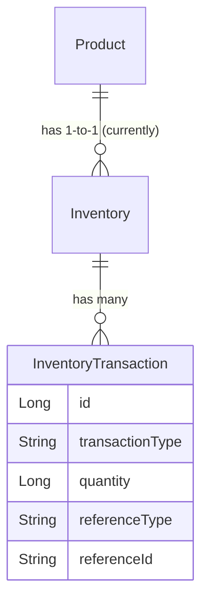
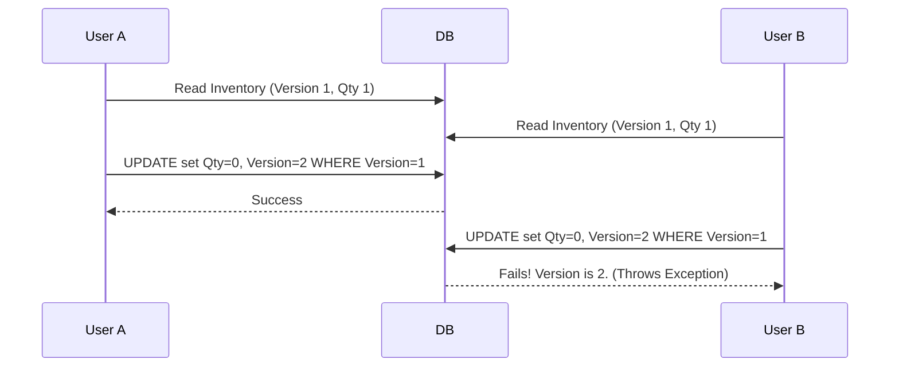

# Inventory Management Learning Guide

## 1. Introduction

### Why Inventory Management Matters
In an e-commerce ecosystem, inventory is the literal bridge between digital promises and physical reality. If an application promises a user they can buy an item, but the warehouse cannot fulfill it, the business suffers reputational damage, support overhead, and financial loss.

### Simple Stock vs. Real Inventory Management
A simple e-commerce tutorial might use a `stock` integer column on a `Product` table. Real-world platforms like Amazon or Flipkart use an **Inventory Ledger** system. They treat inventory like accounting—every single addition, removal, reservation, and damage is recorded immutably. This guarantees auditability, tracing, and precise financial valuation at any given millisecond.

---

## 2. Original System Limitations

Before Phase 1, our application managed inventory by directly updating a `stock` field on the `Product` entity.

### Problems with the `Product.stock` Approach
1. **Missing Audit Trail**: If stock drops from 10 to 5, no one knows *why*. Was it sold? Damaged? Stolen? Adjusted by an admin?
2. **Overselling Risks**: If 10 people put the last item in their cart and checkout simultaneously, the system could go into negative stock if not locked properly.
3. **Payment Failure Problems**: If stock is deducted when an order is placed but the payment fails, that stock is "lost" unless manually tracked and restored.
4. **Cancellation Problems**: If a user cancels an order, restoring the `Product.stock` blindly without tracking the context makes the business blind to return velocity.

---

## 3. Inventory Domain Design

To solve these issues, we adopted a Double-Entry Ledger Pattern for inventory.

### The Entities
- **`Inventory`**: Represents the current absolute state of a product's stock in the warehouse. 
  - `availableQuantity`: Stock available for purchase.
  - `reservedQuantity`: Stock currently sitting in a pending checkout/payment flow.
  - `damagedQuantity`: Stock that was returned broken or found damaged in the warehouse.
- **`InventoryTransaction`**: An immutable log entry. Every change to `Inventory` *must* be accompanied by an `InventoryTransaction`.
- **`InventoryTransactionType`**: Enum dictating what happened (`CONSUME`, `RESTOCK`, `RESERVE`, etc.)

---

## 4. Inventory Lifecycle

The flow of an item through our system looks like this:

1. **Initialization**: Admin creates a Product. `Inventory` is created with 0 quantities.
2. **Restock**: Admin receives a shipment. An `ADJUSTMENT` (+100) transaction is logged. `availableQuantity` = 100.
3. **Reservation**: User A clicks "Checkout". A `RESERVE` (+1) transaction is logged. `availableQuantity` = 99, `reservedQuantity` = 1.
4. **Consumption**: User A completes Payment. A `CONSUME` (+1) transaction is logged. `reservedQuantity` = 0. The item leaves the warehouse legally.
5. **Release (Timeout/Failure)**: User B clicks "Checkout" but closes the browser. A cron job runs 15 minutes later, logs a `RELEASE` (+1) transaction. `reservedQuantity` drops, `availableQuantity` goes back up.
6. **Cancellation**: User A cancels the order before it ships. A `CANCEL_RESTOCK` transaction logs. `availableQuantity` goes up.
7. **Returns**: User A receives the item but returns it.
   - If pristine: `RETURN_RESTOCK` -> `availableQuantity` goes up.
   - If damaged: `RETURN_DAMAGED` -> `damagedQuantity` goes up.

---

## 5. Inventory Transaction Types

| Type | Purpose | Example | DB Impact on `Inventory` |
|------|---------|---------|--------------------------|
| `RESERVE` | Lock stock during payment | User initiates checkout | `available` -, `reserved` + |
| `RELEASE` | Unlock stock if payment fails | Payment gateway declines | `available` +, `reserved` - |
| `CONSUME` | Finalize sale | Payment webhook succeeds | `reserved` - |
| `RESTOCK` | Standard supply delivery | Warehouse receives a truck | `available` + |
| `RETURN_RESTOCK` | Customer returns a good item | Customer didn't like color | `available` + |
| `RETURN_DAMAGED` | Customer returns broken item | Screen cracked in shipping | `damaged` + |
| `ADJUSTMENT` | Manual admin override | Warehouse audit finds 2 lost | `available` (+ or -) |
| `CANCEL_RESTOCK`| Order cancelled before shipping| User clicks "Cancel Order" | `available` + |

---

## 6. Inventory APIs

We exposed administrative APIs to manage and audit this new domain.

- `GET /api/admin/inventory`: Fetches paginated inventory with filters (`lowStock`, `outOfStock`).
- `GET /api/admin/inventory/{id}/transactions`: Fetches the immutable audit trail for a specific product.
- `POST /api/admin/inventory/product/{id}/adjust`: Allows admins to manually adjust stock, requiring a `notes` and `referenceId` payload.
- `GET /api/admin/inventory/analytics`: Generates the real-time valuation and velocity dashboards.

---

## 7. Optimistic Locking

### The Lost Update Problem
If User A and User B both load the page for the last iPhone, they both see `available = 1`. If they both click checkout, Thread A and Thread B might both read `1`, subtract `1`, and save `0`. Both users think they bought the phone, but the warehouse only has one.

### The `@Version` Solution
By adding `@Version private Long version;` to `Inventory`, Hibernate enforces Optimistic Locking.
1. Thread A reads Inventory V1 (qty 1).
2. Thread B reads Inventory V1 (qty 1).
3. Thread A reserves it, saves as V2 (qty 0).
4. Thread B tries to reserve it, but sends `UPDATE ... WHERE version = 1`. The DB returns 0 rows updated because the version is now 2.
5. Thread B throws `ObjectOptimisticLockingFailureException`.

---

## 8. Retry Strategy

When Thread B throws `ObjectOptimisticLockingFailureException`, it's a terrible user experience to show a 500 Error. 

We used Spring Retry `@Retryable`.
If Thread B fails, Spring intercepts the exception, waits 100ms, and tries the entire transaction again. On retry, Thread B reads V2 (qty 0) and cleanly tells the user "Out of stock" instead of crashing.

**Pitfall Discovered:** `@Retryable` MUST wrap the `@Transactional` boundary, not sit inside it. If you put `@Retryable` inside a transaction that has already failed, the Hibernate Session is permanently tainted and will refuse to execute the retry queries. We fixed this by ensuring `@Retryable` is applied at the Service interface boundary.

---

## 9. Reservation System

We reserve stock at **Checkout**, not when an item is added to the Cart. 
- *Why?* If we reserved at Cart, malicious users could add every item in the store to their cart and hold the inventory hostage forever.
- By reserving at Checkout, the user has a 15-minute window (`paymentInitiatedAt`) to complete the payment gateway flow. If they abandon the tab, a Scheduled Job releases the `reservedQuantity` back to `availableQuantity`.

---

## 10. Payment Integration

Payments operate asynchronously. The backend creates an Order, generates a Payment Token, and waits.

### The Late Webhook Problem
What happens if the 15-minute reservation timer expires, we release the stock to another user, and *then* the delayed Stripe Webhook arrives saying "Payment Success"?

**Solution:** We introduced `SUCCESS_REQUIRES_REFUND`. 
If the webhook hits, we check if the order was already timed out/failed. If it was, we cannot fulfill it (stock is gone). We mark it as `SUCCESS_REQUIRES_REFUND`. This alerts the admin/finance team to immediately trigger a gateway refund, safely absorbing the delayed webhook without crashing the inventory system.

---

## 11. Cancellation and Returns

**Item-Level Returns:** We decided *against* a single `RETURNED` order status. Real e-commerce features partial returns (buying 3 shirts, returning 1).
We implemented `OrderItemStatus`. The parent `Order` remains `DELIVERED`, but specific `OrderItem` rows move to `RETURN_REQUESTED` -> `RETURNED`.

When a return is processed, the admin specifies if it was pristine or damaged, resulting in either a `RETURN_RESTOCK` or `RETURN_DAMAGED` transaction, cleanly adjusting the warehouse ledger.

---

## 12. Inventory Analytics

We built a dashboard featuring:
- Low Stock & Out of Stock counts
- Financial Valuation (`SUM(qty * price)`)
- Fast & Slow Moving Products

### The Net Sales Bug
Initially, Fast Moving Products were calculated by `SUM(quantity)` where type = `CONSUME`. 
**The Bug:** If a product was bought 100 times but returned 99 times, it looked like a top seller (Gross sales).
**The Fix:** We refactored the JPQL to calculate *Net Sales* natively in the database using conditional `CASE` statements: `SUM(CASE WHEN type='CONSUME' THEN qty WHEN type='RETURN_RESTOCK' THEN -qty ELSE 0 END)`.

### The "Zero Sales" Left Join
To find Slow Moving products, we needed products with **0 sales**. A standard `JOIN` on `InventoryTransaction` hides products with no history. We used a `LEFT JOIN` rooted on `Inventory` and a `COALESCE` to guarantee that unsold items rank at the very top of the slow-moving list.

---

## 13. Hardening Improvements

Before declaring the module production-ready, we applied critical hardening:

1. **Order Optimistic Locking:** We enforced `@Retryable` on `Order` updates. If an admin cancels an order at the exact millisecond the payment webhook arrives, Optimistic Locking prevents a "Lost Update" where the order gets stuck in a corrupted state.
2. **Ledger Idempotency Constraints:** We added a hard database `UNIQUE` index on `(reference_type, reference_id, transaction_type)` in the transaction table. If a bug causes the app to execute a webhook twice, the DB will physically reject the duplicate double-entry, guaranteeing ledger integrity.
3. **Transaction Boundary Review:** We decoupled HTTP calls from DB transactions in `PaymentServiceImpl` to prevent network latency from freezing the HikariCP connection pool.

---

## 14. Important Design Decisions

| Decision | Alternative Considered | Why We Chose It |
|----------|------------------------|-----------------|
| **Checkout Reservation** | Cart Reservation | Cart reservation allows malicious actors to freeze inventory indefinitely. |
| **String `referenceId`** | Foreign Keys (`order_id`) | Transactions must link to Orders, Payments, Admin Audits, etc. Polymorphic strings allow ultimate flexibility. |
| **JPQL Aggregations** | Java Memory Streams | Pulling 100k rows into Java to `SUM()` them causes `OutOfMemoryErrors`. DBs do math infinitely faster. |
| **Item-Level Returns** | Order-Level Returns | Fails real-world business requirements for partial refunds. |

---

## 15. Problems Discovered During Development

- **The `@Transactional` vs `@Retryable` Proxy Conflict**: We initially placed `@Retryable` on a private method inside a `@Transactional` class. We learned that Spring AOP Proxies do not intercept internal method calls, and that retrying a failed transaction block without rolling back the EntityManager state is fatal.
- **Gross vs Net Analytics**: We realized that our BI dashboards were lying to the business by ignoring restocks and cancellations. Fixing this taught us how to embed advanced `CASE` logic into JPQL.

---

## 16. Real World Scaling Considerations

While robust, if this system scaled to millions of concurrent users (e.g., a massive flash sale):

- **Optimistic Locking Starvation**: `@Version` fails under extreme contention. 10,000 users fighting for 100 items will result in a retry-storm that crashes the DB connection pool.
- **Future Solution**: Introduce **Redis**. Reserve stock using a Redis atomic `DECR` operation. Only when Redis grants the lock do we touch the MySQL database.
- **Multi-Warehouse**: The current `Inventory` table assumes a 1:1 relationship with `Product`. In the future, the primary key must evolve to `(warehouse_id, product_id)`.

---

## 17. Interview Preparation Notes

**Questions I Should Be Able To Answer:**

- *Q: How do you prevent overselling?*
  - A: Implement an Inventory Ledger, split quantities into `available` and `reserved`, lock at checkout, and enforce DB-level Optimistic Locking (`@Version`) with application-level retries (`@Retryable`).
- *Q: How do you handle idempotency in payment webhooks?*
  - A: Check the state machine first (`if status == SUCCESS return`). As a final defense, apply a `UNIQUE` database constraint on the `(reference_type, reference_id)` in the ledger so the DB physically rejects duplicate double-entries.
- *Q: Why not hold a database transaction while calling Stripe/Razorpay?*
  - A: Network calls are infinitely slower than DB queries. Holding a transaction open while waiting 2 seconds for Stripe will exhaust the HikariCP connection pool under high traffic, bringing down the whole system.

---

## 18. Key Takeaways

1. **Double-Entry Accounting is King**: Never just `UPDATE stock = stock - 1`. Always log a transaction.
2. **State Machines Save Lives**: A robust state machine (`INITIATED -> SUCCESS_REQUIRES_REFUND`) cleanly resolves distributed system race conditions (like late webhooks).
3. **The DB is the Source of Truth**: Application logic has bugs. Pods crash. The database's `UNIQUE` constraints and `@Version` columns are your final, unbreakable layer of defense. 
4. **Think in "Net", not "Gross"**: Business analytics must account for the full lifecycle, including returns and cancellations.
